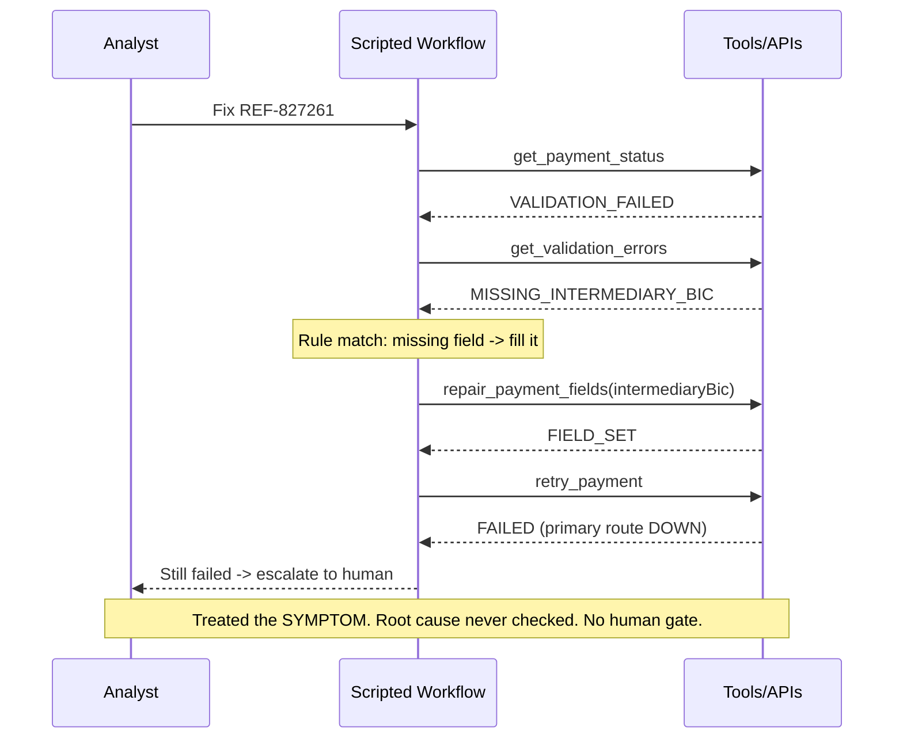
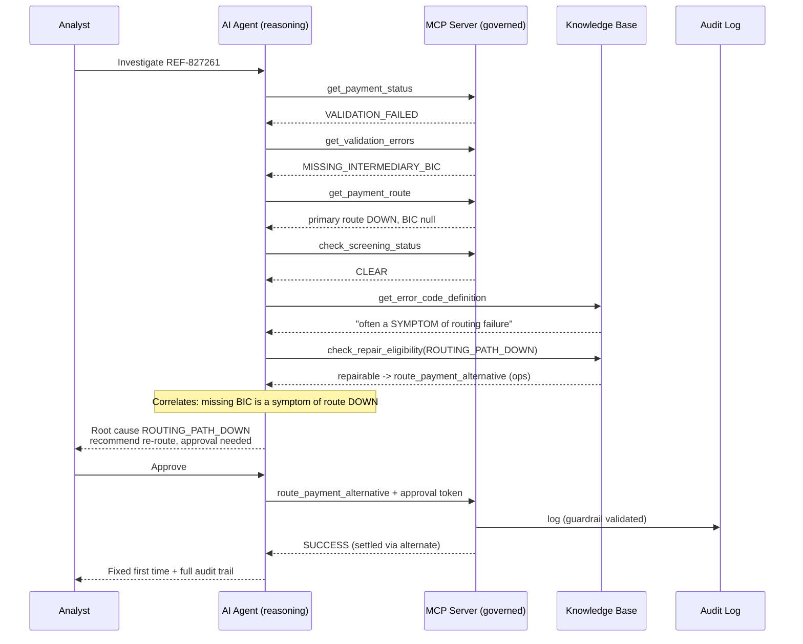
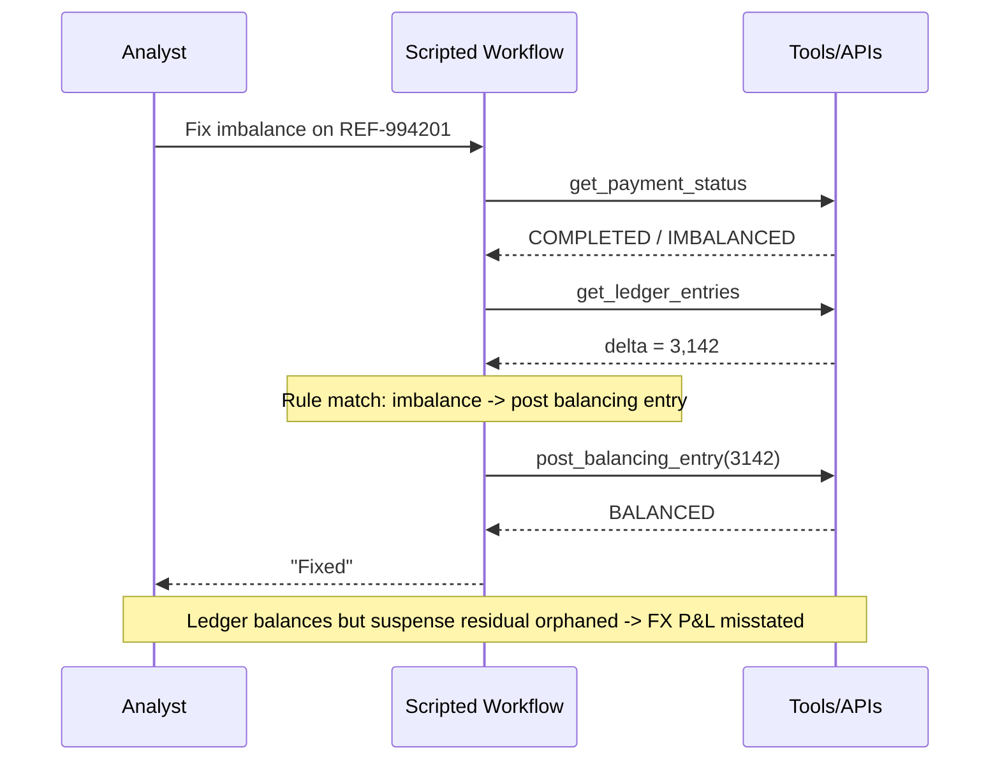
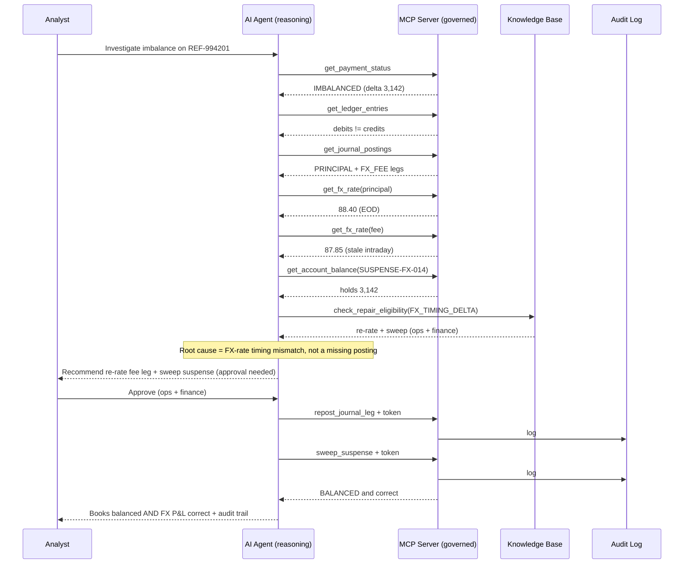

Here are side-by-side sequence diagrams for both use cases, drawn from the actual flows in the running app.

## Use Case 1 — REF-827261 (validation error that's really a routing failure)

### Without AI (scripted workflow)



### With AI + MCP



**Advantage:** the script blindly fixed the symptom and failed; the agent gathered routing + knowledge evidence, identified the *true* cause, and the MCP layer enforced human approval + audit before any money moved.

## Use Case 2 — REF-994201 (ledger imbalance that's really an FX-timing mismatch)

### Without AI (scripted workflow)



### With AI + MCP



**Advantage:** the script made the ledger *balance* but left the books *wrong*; the agent reasoned about *why* the legs differed (comparing FX rates across systems), chose the correct re-rate-and-sweep playbook, and required dual ops+finance approval — all logged.

## The pattern both diagrams reveal

| | Without AI | With AI + MCP |
|---|---|---|
| Decision logic | fixed `if/else` symptom match | reasons over correlated evidence |
| Cross-system correlation | none (one signal) | routing/ledger/FX + knowledge base |
| Symptom vs. root cause | treats symptom | identifies true cause |
| Outcome | fails / corrupts books | correct fix, first time |
| Governance | self-acts, no gate | approval-gated + full audit |


## First, the honest baseline

For **high-frequency, stable, well-understood** payment flows — the happy path — traditional workflow code is excellent and AI would be wasteful. We are **not** proposing to replace those scripts.

The value of AI+MCP shows up in the **long tail**: the compound, ambiguous, never-seen-before failures that dominate the time of our operations team. That's the comparison that matters.

A simple way to decide: plot failures by **frequency vs. variety**.
- High frequency / low variety → **script it**.
- Low frequency / high variety → **AI + MCP**.

---

## What each layer actually does

It helps to separate three things people tend to lump together:

| Layer | Role | Replaces / Adds |
|---|---|---|
| **The orchestration loop** | Call tool A → B → lookup rule → act | *Scriptable.* Not where AI adds value. |
| **The decision at each step** | Which tool? What args? Symptom or cause? Safe to fix? | **AI replaces hand-coded branches with reasoning.** |
| **MCP** | Schema validation, permissions, human approval, audit | **The control layer that makes AI action safe.** |

Key insight: **AI provides flexibility; MCP provides the safety rails that make that flexibility acceptable in a regulated bank.** A pure script doesn't need MCP because the governance is baked into the code — but the moment a reasoning agent can *choose* actions, you need MCP to bound what it's allowed to do.

---

## Execution: scripted vs. AI+MCP

A workflow is really a chain of decisions:

```
state → DECIDE next step → state → DECIDE → ... → DECIDE final action
```

In scripted automation, **we** write every `DECIDE` as explicit `if/else` logic. This means:

- We must **enumerate every failure mode in advance.** Real failures are *combinations* across systems (validation × routing × liquidity × FX-timing × suspense state). The branches multiply faster than anyone can write or maintain.
- Scripts **match symptoms**, they don't interpret causes — so they fire the *wrong fix confidently* when the obvious signal is actually a downstream symptom.
- Anything not pre-coded falls into the **`else` → escalate to human** bucket, which in real ops is the *majority* of tickets.

AI+MCP replaces the `DECIDE` function with general reasoning that:
- correlates evidence across multiple systems,
- distinguishes **symptom from root cause**,
- handles **combinations and novel cases** it was never explicitly programmed for,
- and answers **ad-hoc, natural-language** investigation requests.

---

## Maintenance: the long-term difference

| Dimension | Scripted workflow (no AI) | AI + MCP |
|---|---|---|
| New error code / new failure combo | Add branch → test → redeploy (days/weeks) | Retrieve rule from knowledge base, reason by analogy — **no code change** |
| New payment product / rail | New API client, new auth, new branches, new tests | **Drop the OpenAPI spec** → auto-discovered, usable via the same generic tool |
| Updating business rules | Edit code, redeploy | Update the **knowledge base** (rules live outside the model) — no model or agent redeploy |
| Cost as rules grow | Grows steeply with every edge case | Roughly **flat** |
| Governance / audit | Scattered across services | **Centralized** at the MCP layer — every call validated, permissioned, logged |
| Reusability across AI hosts | N/A | Same MCP tools work with any model (GPT, Claude, future) |

The maintenance story is the strongest long-term argument: **knowledge and capabilities live outside the model**, surfaced at runtime (via MCP Resources / retrieval), so we update *rules and specs*, not *code and weights*.

---

## Use Case 1 — Compound payment failure (symptom ≠ cause)

**Scenario:** Cross-border payment fails with validation error `MISSING_INTERMEDIARY_BIC`. The *real* cause is that the **primary routing path was down**, so the routing service never populated the intermediary bank field. The validation error is a **symptom**.

**Scripted workflow:** Matches `MISSING_INTERMEDIARY_BIC` → looks up the BIC → re-enters it → retries → **fails again** (routing is still down). It did the wrong fix faster, because it matched a string and never connected "empty field" to "routing failure."

**AI + MCP:**
```
→ trace_payment()          FAILED / VALIDATION_FAILED
→ get_validation_errors()  [MISSING_INTERMEDIARY_BIC]
→ get_payment_route()      primary_route: DOWN, intermediary_bic: null ⚠️
→ check_screening_status() CLEAR

🧠 The missing BIC is a SYMPTOM of the routing failure, not a data error.
   Filling it manually would fail again. Routing Recovery playbook applies.

📘 Root cause: Primary routing path unavailable
🛠️ Recommend:  Route via alternate clearing channel  → REQUIRES APPROVAL
```
Analyst approves; MCP validates, logs, executes. Correct fix on the first attempt.

**Why AI+MCP won:** it kept digging past the obvious error, **correlated systems the script was never told to connect**, chose the right playbook, and acted only under governed human approval.

---

## Use Case 2 — Ledger imbalance on a specific payment

**Scenario:** A payment is `COMPLETED`, but reconciliation flags the ledger **off by ₹3,142**. It *looks* like a missing credit posting. The *real* cause: the payment booked in two legs — **principal at the corrected EOD FX rate, fee leg at a stale intraday rate** — and the difference correctly landed in an **FX suspense account** but was never swept.

**Scripted workflow:** Detects the imbalance → posts a ₹3,142 balancing entry → "balanced!" But this **corrupts FX P&L** and hides a real reconciliation issue; days later the suspense account is wrong and finance raises a worse ticket. The script treats every imbalance identically because it has no concept of *why* the legs differ.

**AI + MCP:**
```
→ get_ledger_entries()     debits ₹50,03,142 vs credits ₹50,00,000 (Δ 3,142)
→ get_journal_postings()   PRINCIPAL @ 88.40, FX_FEE @ 87.85 → SUSPENSE-FX-014
→ get_fx_rate(...)         confirms stale vs corrected rate
→ check_repair_eligibility("FX_TIMING_DELTA")   repairable, needs finance sign-off

🧠 Not a missing leg — an FX-rate timing mismatch parked in suspense.
   A blind balancing entry would corrupt P&L.

📘 Root cause: FX-rate timing mismatch between principal and fee legs
🛠️ Recommend:  Re-rate fee leg at EOD + sweep suspense → REQUIRES APPROVAL (ops + finance)
```
Books end up **balanced *and* correct**, with the FX issue properly attributed and a full audit trail.

**Why AI+MCP won:** it made the ledger *correct*, not just *balanced* — reasoning about cause, grounding in the knowledge base, and routing a sensitive GL write through dual-control approval. Note MCP never gave the model raw GL write access; it could only *propose* gated repair tools.

---

## Bottom line

> Script the predictable 80% — AI is wasteful there. AI+MCP earns its place on the **other 20%**: the compound, ambiguous, unseen failures where a script either escalates to a human or confidently does the *wrong* thing.
>
> **AI replaces hand-coded decisions with reasoning. MCP makes that reasoning safe, governed, and auditable. Knowledge and capabilities live outside the model, so we maintain rules and specs — not code and weights.**

We're not replacing our workflows. We're covering the long tail they were never able to handle — safely.
