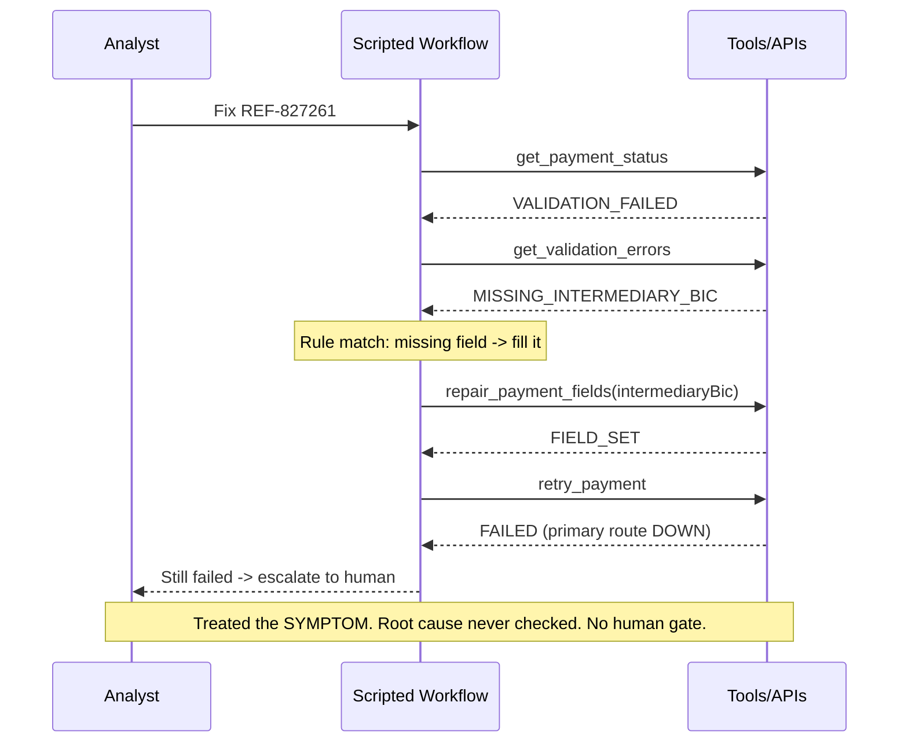
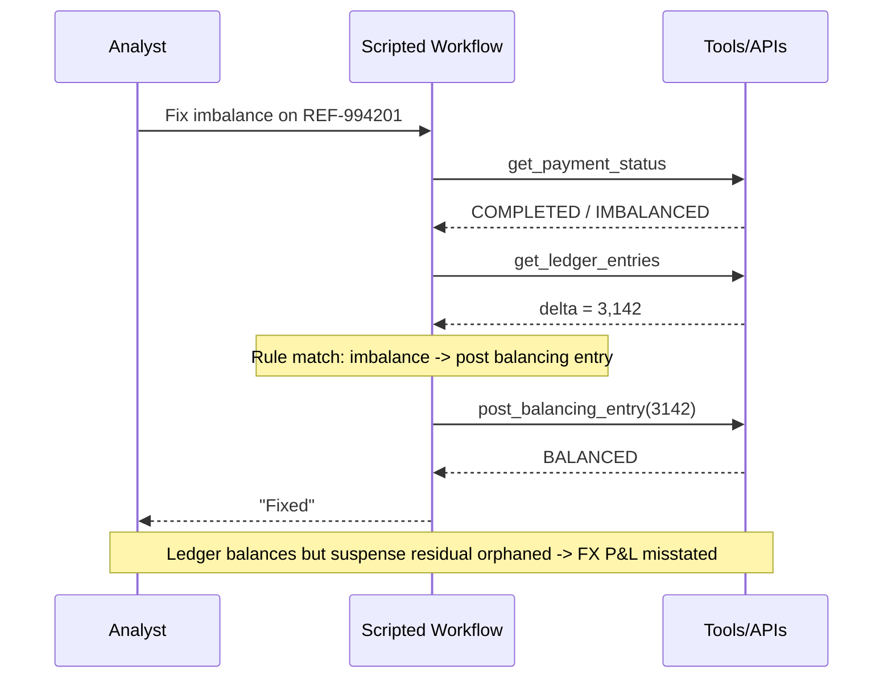
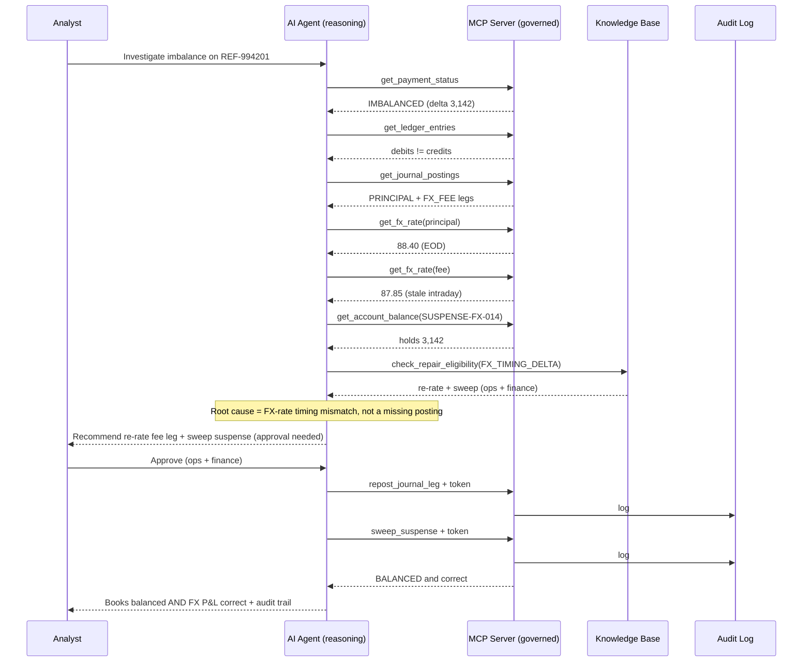

Here are side-by-side sequence diagrams for both use cases, drawn from the actual flows in the running app.

## Use Case 1 — REF-827261 (validation error that's really a routing failure)

### Without AI (scripted workflow)



### With AI + MCP

```mermaid
sequenceDiagram
    participant Ops as Analyst
    participant Agent as AI Agent (reasoning)
    participant MCP as MCP Server (governed)
    participant KB as Knowledge Base
    participant Audit as Audit Log
    Ops->>Agent: Investigate REF-827261
    Agent->>MCP: get_payment_status
    MCP-->>Agent: VALIDATION_FAILED
    Agent->>MCP: get_validation_errors
    MCP-->>Agent: MISSING_INTERMEDIARY_BIC
    Agent->>MCP: get_payment_route
    MCP-->>Agent: primary route DOWN, BIC null
    Agent->>MCP: check_screening_status
    MCP-->>Agent: CLEAR
    Agent->>KB: get_error_code_definition
    KB-->>Agent: "often a SYMPTOM of routing failure"
    Agent->>KB: check_repair_eligibility(ROUTING_PATH_DOWN)
    KB-->>Agent: repairable -> route_payment_alternative (ops)
    Note over Agent: Correlates: missing BIC is a symptom of route DOWN
    Agent-->>Ops: Root cause ROUTING_PATH_DOWN; recommend re-route (approval needed)
    Ops->>Agent: Approve
    Agent->>MCP: route_payment_alternative + approval token
    MCP->>Audit: log (guardrail validated)
    MCP-->>Agent: SUCCESS (settled via alternate)
    Agent-->>Ops: Fixed first time + full audit trail
```

**Advantage:** the script blindly fixed the symptom and failed; the agent gathered routing + knowledge evidence, identified the *true* cause, and the MCP layer enforced human approval + audit before any money moved.

## Use Case 2 — REF-994201 (ledger imbalance that's really an FX-timing mismatch)

### Without AI (scripted workflow)



### With AI + MCP



**Advantage:** the script made the ledger *balance* but left the books *wrong*; the agent reasoned about *why* the legs differed (comparing FX rates across systems), chose the correct re-rate-and-sweep playbook, and required dual ops+finance approval — all logged.

## The pattern both diagrams reveal

| | Without AI | With AI + MCP |
|---|---|---|
| Decision logic | fixed `if/else` symptom match | reasons over correlated evidence |
| Cross-system correlation | none (one signal) | routing/ledger/FX + knowledge base |
| Symptom vs. root cause | treats symptom | identifies true cause |
| Outcome | fails / corrupts books | correct fix, first time |
| Governance | self-acts, no gate | approval-gated + full audit |

Want me to add these diagrams to the `README.md` (e.g., a "Sequence comparison" section)? I can drop them in.
